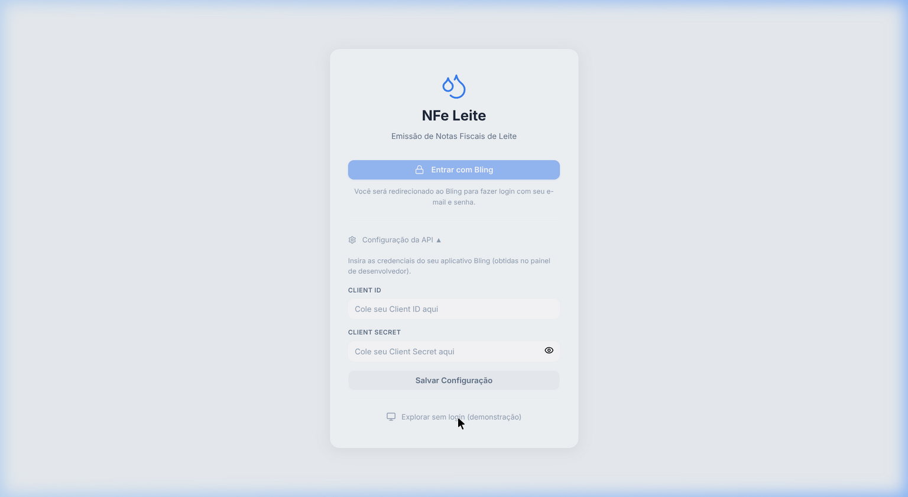
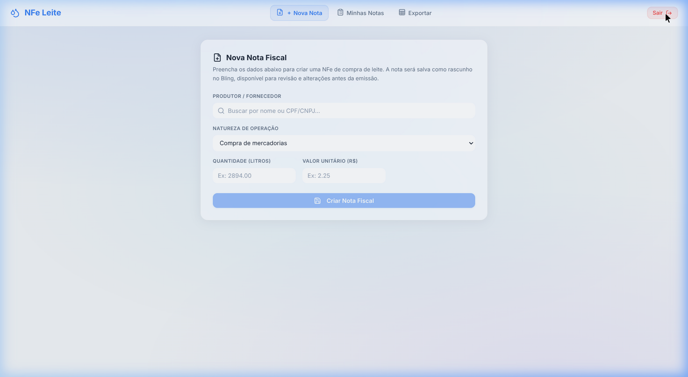

<div align="center">

# 🥛 NFe Leite

**Automated NFe (Nota Fiscal Eletrônica) management system for dairy producers in Minas Gerais, Brazil**

Streamlines invoice creation and exports data to the **SEFAZ-MG tributary credit spreadsheet** — replacing hours of manual data entry with a single click.

[](https://nfe-serramineira.vercel.app/)

[](https://react.dev)
[](https://vitejs.dev)
[](https://developer.bling.com.br)
[](https://developers.google.com/sheets/api)
[](https://opensource.org/licenses/MIT)

<br/>



<p><em>OAuth2 login with Bling ERP — glassmorphism UI</em></p>

</div>

---

## 📋 About

In the state of **Minas Gerais (Brazil)**, dairy producers who sell raw milk must issue Notas Fiscais Eletrônicas (NFe) for every transaction and report them to **SEFAZ-MG** via a standardized spreadsheet to claim **ICMS tributary credit**.

This process is traditionally done **manually** — copying invoice data field by field into a government-mandated spreadsheet format. **NFe Leite** automates the entire workflow:

1. **Create NFe invoices** through the Bling ERP API with pre-calculated tax fields (ICMS, FUNRURAL, incentive surcharges)
2. **Manage and track** all issued invoices with real-time status from SEFAZ
3. **Export to Google Sheets** in the exact format required by SEFAZ-MG for tributary credit claims

> **Real-world impact:** This tool is actively used by a dairy business in Minas Gerais, saving ~4 hours of manual data entry per month.

---

## ✨ Features

| Feature | Description |
|---|---|
| **NFe Creation** | Create purchase invoices for raw milk with automatic tax calculations (ICMS 12%, FUNRURAL 1.5%, incentive surcharge 2.5%) |
| **Contact Lookup** | Searchable dropdown fetching suppliers/producers directly from Bling with address auto-fill |
| **Invoice Management** | List, filter, and inspect all NFe with real-time SEFAZ status badges |
| **SEFAZ Submission** | Send invoices to SEFAZ directly from the interface |
| **Google Sheets Export** | One-click export to the SEFAZ-MG tributary credit spreadsheet format with all 14 required columns |
| **OAuth2 Authentication** | Secure Bling OAuth2 flow with automatic token refresh |
| **Demo Mode** | Full UI walkthrough without API credentials |
| **Rate Limiting** | Built-in API throttle (3 req/s) to respect Bling API limits |

---

## 🖥️ Screenshots

<div align="center">



<p><em>NFe creation form with automatic tax calculation preview</em></p>

</div>

---

## 🏗️ Architecture

```
┌─────────────────────────────────────────────────────────┐
│                    React Frontend                       │
│                                                         │
│  ┌──────────┐  ┌──────────┐  ┌───────────────────────┐  │
│  │  Login   │  │ NfeForm  │  │    SheetsExport       │  │
│  │ (OAuth2) │  │ (Create) │  │ (Google Sheets API)   │  │
│  └────┬─────┘  └────┬─────┘  └──────────┬────────────┘  │
│       │              │                   │               │
│  ┌────┴──────────────┴───────────────────┴────────────┐  │
│  │              nfeService.js + apiThrottle.js         │  │
│  │         (API client layer with rate limiting)       │  │
│  └────────────────────────┬───────────────────────────┘  │
└───────────────────────────┼──────────────────────────────┘
                            │  Vite proxy / Vercel rewrites
                            ▼
              ┌─────────────────────────┐
              │    Bling API v3         │
              │  (ERP + NFe + OAuth)    │
              └─────────────────────────┘
```

**Key design decisions:**

- **No backend needed** — The app runs entirely in the browser. API calls to Bling are proxied through Vite (dev) or Vercel rewrites (prod) to avoid CORS issues.
- **Credentials stay client-side** — OAuth Client ID/Secret are entered by the user and stored only in `localStorage`. Nothing is hardcoded or sent to a server.
- **Rate-limit-aware** — A custom `throttledFetch` queues all API calls to stay within Bling's 3 requests/second limit, preventing 429 errors.

---

## 🚀 Getting Started

### Prerequisites

- [Node.js](https://nodejs.org/) 18+
- A [Bling ERP](https://www.bling.com.br) account with API access
- *(Optional)* A Google Cloud project with the **Sheets API** enabled for the export feature

### Installation

```bash
# Clone the repository
git clone https://github.com/ronanpjr/nfe-leite.git
cd nfe-leite

# Install dependencies
npm install

# Start the development server
npm run dev
```

The app will be available at `http://localhost:5173`.

### Demo Mode

You can explore the full UI **without any API credentials** by clicking **"Explorar sem login (demonstração)"** on the login screen. This uses mock data to simulate the complete workflow.

### Bling API Setup

1. Go to the [Bling Developer Panel](https://developer.bling.com.br)
2. Create a new application and note your **Client ID** and **Client Secret**
3. Set the redirect URI to your app's URL (e.g. `http://localhost:5173/`)
4. Enter these credentials in the app's login screen under **"Configuração da API"**

---

## 📊 SEFAZ-MG Export Format

The Google Sheets export produces rows matching the official SEFAZ-MG tributary credit spreadsheet format:

| Column | Field | Description |
|---|---|---|
| A | `CD_PRODUTOR_IE` | Producer's State Registration (IE) |
| B | `DT_NF` | Invoice date (DD/MM/YYYY) |
| C | `NR_NF` | Invoice number |
| D | `CD_SERIE` | Series code |
| E | `CD_CHAVE` | NFe access key (44 digits) |
| F | `FL_RESPONSABILIDADE` | Responsibility flag |
| G | `QT_LITROS` | Quantity in liters |
| H | `VR_TOTAL` | Total invoice value |
| I | `VR_MERCADORIA` | Merchandise value |
| J | `VR_FRETE` | Freight value |
| K | `VR_BC` | ICMS tax base |
| L | `VR_DEDUCOES` | Deductions |
| M | `VR_INCENTIVO` | Incentive surcharge (2.5%) |
| N | `VR-ICMS` | ICMS value (12%) |

---

## 🛠️ Tech Stack

| Technology | Purpose |
|---|---|
| **React 19** | UI framework with hooks-based architecture |
| **Vite 6** | Build tool and dev server with API proxy |
| **Lucide React** | Icon library |
| **Bling API v3** | ERP integration (NFe, contacts, operations) |
| **Google Sheets API** | Spreadsheet export via OAuth2 |
| **Vercel** | Production deployment with serverless rewrites |
| **Vanilla CSS** | Custom glassmorphism design system |

---

## 📁 Project Structure

```
src/
├── App.jsx                 # Main app shell, OAuth flow, tab routing
├── main.jsx                # React entry point
├── index.css               # Global styles & glassmorphism design system
├── nfeService.js           # Bling API client (OAuth, NFe CRUD, contacts)
├── sheetsService.js        # Google Sheets export logic & column mapping
├── apiThrottle.js          # Rate-limiting queue for Bling API (3 req/s)
├── mockApi.js              # Mock data layer for demo mode
└── components/
    ├── Login.jsx            # OAuth login with collapsible API config
    ├── NfeForm.jsx          # NFe creation form with tax preview
    ├── NfeList.jsx          # Invoice list with status badges & actions
    └── SheetsExport.jsx     # Google Sheets export with preview table
```

---

## 🚢 Deployment

The project is configured for **Vercel** out of the box:

The app is live at **[nfe-serramineira.vercel.app](https://nfe-serramineira.vercel.app/)**.

```bash
# Build for production
npm run build

# Deploy to Vercel
vercel --prod
```

The `vercel.json` file handles API proxy rewrites to Bling's servers automatically.

---

## 📄 License

This project is licensed under the MIT License — see the [LICENSE](LICENSE) file for details.

---

<div align="center">

**Built with ☕ in Minas Gerais, Brazil**

</div>
